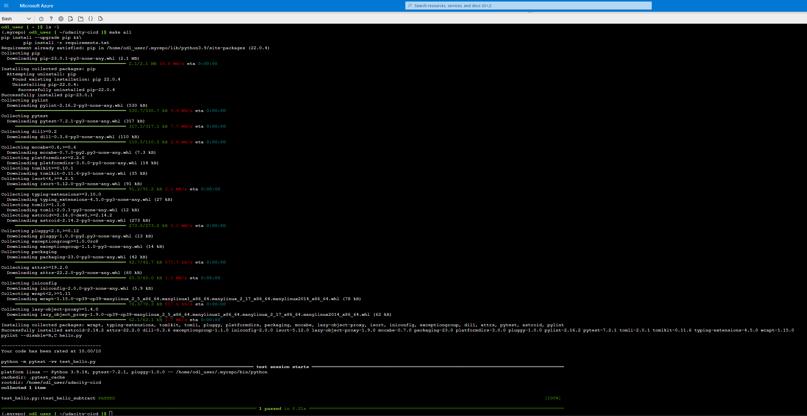
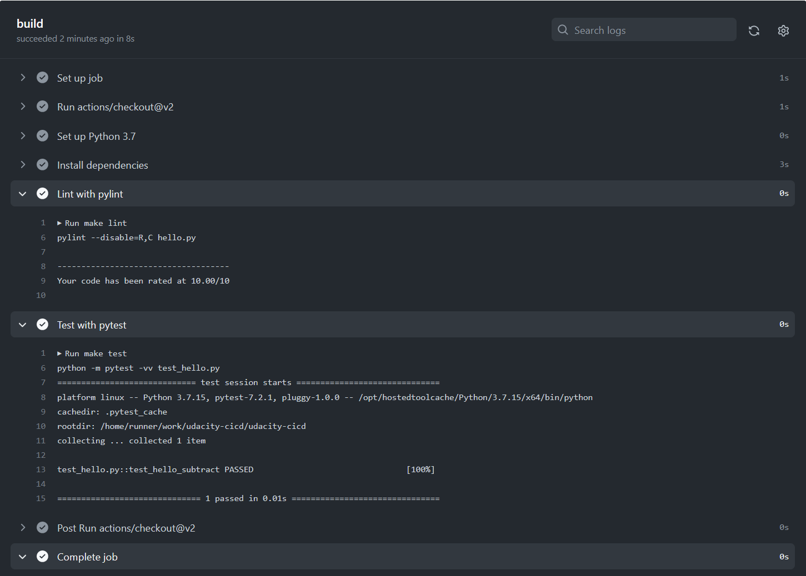
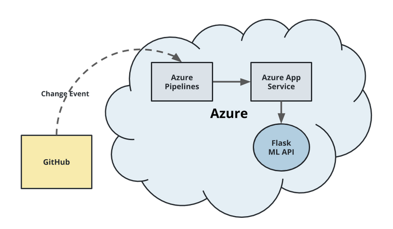
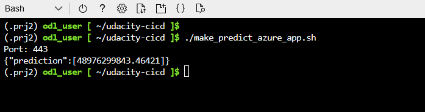
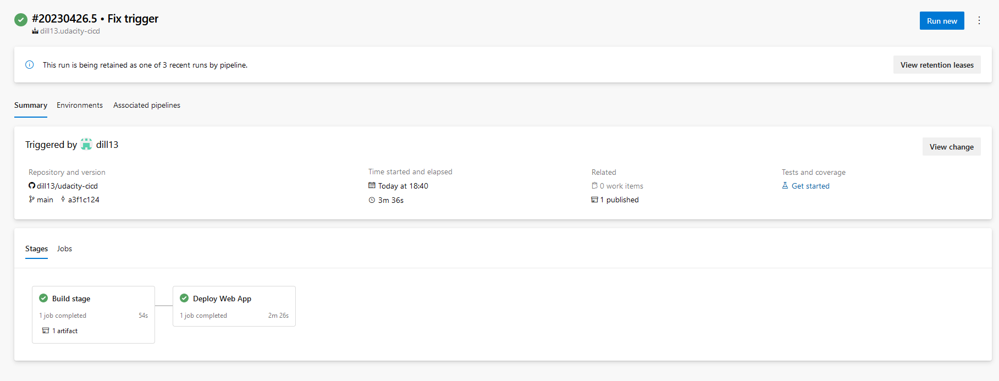
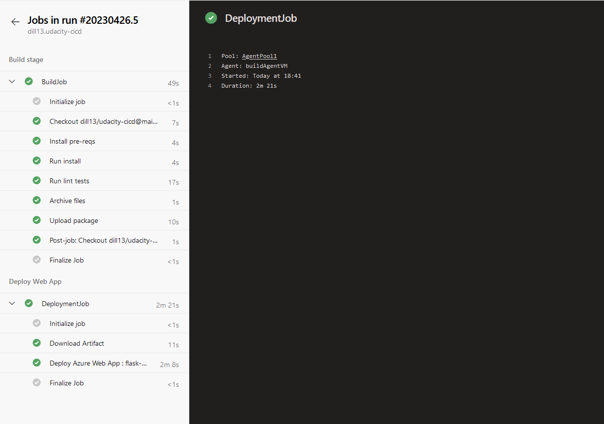

# Overview

This project aims to demonstrate the use of Azure pipelines performing CI/CD delivery of a flask web application into Azure.

## Project Plan
[Excel Project Plan](documents/plan.xlsx)

[Trello board](https://trello.com/b/9uTtQnL1/house-price-prediction-app)

## Boilerplate construction phase
During early project set up, Github actions were used to demonstrate an automated build & test phases of Makefile.  This was later replaced with the Azure pipeline build & deployment of the full working application.  But the evidence of that preparatory phase in action can be seen below.



## Instructions
The end objective is to establish this system architecture



### Using Azure Cloud Shell to deploy the application
First get the project launched from Azure Cloud Shell.  Create ssh key access to your derivative of the repository and clone the repo there.  E.g.
```
ssh-keygen -o -t rsa -b 4096
<Authorise the generated SSH public key in your Github repo> 
git clone https://github.com/[username]/udacity-cicd.git
```
See [here](documents/Screen-RepoInCloudShell.png) for an example.
You'll find the necessary commands to prepare the shell environment and deploy the application in [commands.sh](commands.sh) and there is sample output from that running the make all and deployment of the final version [here](documents/Output-commands.sh.txt)

Once deployed, you'll be able to call `./make_predict_azure_app.sh` to check it ...



The logs from the app can be viewed using `az webapp log` for [example](documents/Screen-ActiveAppLog.png)

### Load testing
Locust was used to load test the application.  The script can be found in [locustfile.py](locustfile.py) and [here](documents/Screen-LocustLoadTest.png) are some images of that in action.

### Preparing for Azure pipeline
You could use Microsoft build service (or Github actions instead of Azure pipeline), but I used a self hosted build server, spun up like this ...
```
az vm create --name buildAgentVM --resource-group Azuredevops --image "Ubuntu2204" --size "Standard_DS1_v2" --authentication-type password --admin-password "<YourPasswordHere>" --admin-username "<AdminUserName>" --public-ip-address buildAgentVMIp

az vm open-port -n buildAgentVM -g Azuredevops --port 22
```

Once up, connect to the VM using ssh, then install and configure the necessary Agent and build tools to support the pipeline ...
```
sudo snap install docker
sudo groupadd docker
sudo usermod -aG docker $USER
[Restart the VM]
```
Log into [devops](https://dev.azure.com) and create a new project.  Create a Personal access token from the User settings menu, remembering to note the value.  From the Project settings create a new Agent pool named e.g. "AgentPool1" with type "self-hosted" and access to all pipelines.  Add a new agent and use the commands from the popup to further configure the build server.  E.g.
```
curl -O https://vstsagentpackage.azureedge.net/agent/3.220.0/vsts-agent-linux-x64-3.220.0.tar.gz
mkdir myagent && cd myagent
tar zxvf ~/vsts-agent-linux-x64-3.220.0.tar.gz
./config.sh
```
When prompted, enter your devops URL e.g. `https://dev.azure.com/odluser232144`, choose PAT authentication and enter the PAT code just created.  Then extend the config ...
```
sudo ./svc.sh install
sudo ./svc.sh start
sudo apt-get update
sudo apt update
sudo apt install software-properties-common
sudo add-apt-repository ppa:deadsnakes/ppa
sudo apt install python3.7
sudo apt-get install python3.7-venv
sudo apt-get install python3-pip
sudo apt-get install python3.7-distutils
sudo apt-get -y install zip
pip install pylint==2.13.7
pip show --files pylint
export PATH=$HOME/.local/bin:$PATH
echo $PATH
```
From within the devops project settings, create a new service connection with type "Azure Resource Manager" and appropriate links to your Azure environment.

### Connecting up the pipeline
From the devops project, create a new pipeline with type GitHub YAML.  Once pointing at the correct repo, it should find the existing [azure-pipelines.yml](azure-pipelines.yml).  You may need to customise variables such as azureServiceConnectionId, webAppName, etc to suite your environment and chosen naming.
Choose the option to Save and Run. On its' first run, you will need to authorise access for each stage manually from the pipeline's execution dialogue.

Having completed the first run manually, the build and deployment should then get automatically triggered whenever source is checked into the main branch in GitHub, such as like this ...




## Enhancements

The "make" test phase, which has placeholders here, could be extended to perform more meaningful validation of the application code.

The locust testing could be extended and perhaps included as an automated test phase to verify web app functionality post-deployment.

## Demo 

<TODO: Add link Screencast on YouTube>


## Credits
Locust test design was inspired by this [article](https://www.blazemeter.com/blog/locust-python)